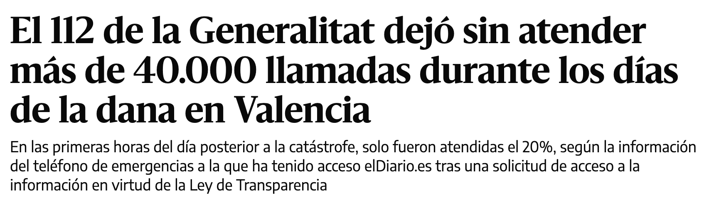
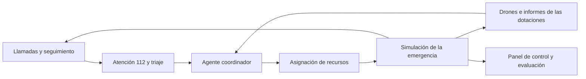

# SUCARA · ¿Puede una IA coordinar la respuesta a una catástrofe?

**HackSpain 2026 · Track HappyRobot · DANA de Valencia**

Un entorno de simulación para poner a prueba agentes que reciben avisos, priorizan emergencias y coordinan recursos con información incompleta. Nuestro objetivo: **reducir el número de fallecidos en una catástrofe**.

## 1. El problema: cada llamada puede cambiar una decisión

En la presentación partimos de un dato de la DANA de Valencia: **40.000 llamadas sin atender en 48 horas**. Cuando la atención se satura, también se pierde información sobre quién necesita ayuda, dónde está y cómo está evolucionando su situación.



<sub>elDiario.es · Recorte aportado por el equipo.</sub>

Una incidencia leve puede empeorar mientras espera. Una ambulancia puede encontrarse una calle cortada. Un barrio puede quedar aislado sin que nadie consiga avisar. Coordinar la respuesta exige actualizar continuamente lo que sabemos.

## 2. La propuesta: un coordinador al que podemos poner a prueba

Construimos una simulación sobre el callejero real de Valencia en la que un **agente coordinador** dispone de herramientas para asignar recursos y ejecutar planes: enviar ambulancias, movilizar bomberos, ordenar rescates o explorar una zona con drones.

La simulación hace avanzar la emergencia: aparecen incidentes, sube el agua, se cortan calles y las víctimas empeoran si no reciben ayuda. El coordinador debe adaptar sus decisiones a esa evolución.

**El agente no es omnisciente.** Solo conoce lo que le comunican las llamadas, las dotaciones y los sistemas de observación. La realidad completa queda en el simulador y permite evaluar sus decisiones después.



## 3. El experimento: qué hace que el agente decida mejor

Creamos un **benchmark de escenarios simulados** para comparar estrategias y distintas heurísticas de razonamiento bajo información parcial, con el número de fallecidos como criterio principal.

La observación del equipo durante el hackathon fue que añadir muchas reglas no aportaba una mejora clara frente al comportamiento del agente con pocas instrucciones. **Lo que más marcaba la diferencia era la información disponible para decidir.**

Ese aprendizaje orientó el proyecto hacia ampliar la capacidad de observar y escuchar:

| Fuente | Qué aporta |
| --- | --- |
| Drones | Explorar zonas de las que no llegan llamadas y detectar agua, obstáculos o posibles emergencias. |
| Redes sociales y canales ciudadanos | Buscar avisos relevantes entre mensajes dispersos, una vía explorada en el laboratorio de evaluación. |
| Más capacidad de recepción | Incorporar más emergencias al sistema de atención telefónica. |
| Llamadas de seguimiento | Actualizar incidencias pendientes y detectar si su prioridad ha aumentado. |

## 4. HappyRobot: una mesa de atención 112 con agentes

La integración con HappyRobot automatiza dos tareas del equipo de atención telefónica:

- **Recepción de emergencias:** recoger lo ocurrido y convertir la conversación en un aviso que pueda utilizar el coordinador.
- **Seguimiento de incidencias:** volver a contactar con casos de menor prioridad para comprobar si la situación sigue estable o necesita una respuesta más urgente.

Un **agente de triaje** clasifica las incidencias por prioridad, mientras la **orquestación** coordina la ejecución de los distintos agentes. Así, la información recogida en una llamada puede modificar la siguiente decisión de despliegue.

## 5. La demo: ver qué ocurre y qué sabe el agente

El **Control Center** permite seguir una simulación o reproducir una ejecución guardada: consultar el mapa, revisar incidencias, ver unidades y hospitales, y recorrer la cronología de avisos y decisiones.

La demo conecta tres piezas: **simulación de la catástrofe, coordinación de recursos y atención telefónica con HappyRobot**. El panel permite inspeccionar cómo se comporta el sistema y dónde necesita intervención humana.

El proyecto es un prototipo de hackathon evaluado en simulación. Las decisiones manuales del operador se registran en la interfaz; su envío al motor está pendiente de integración.

## Guía rápida para levantar el repositorio

### Demo local sin claves de API

Necesitas **Node.js 22.13 o superior y npm**. Desde la raíz del repositorio:

```sh
cd crisis-observatory
npm ci
npm run data:local
npm run dev
```

Abre **[http://localhost:5173](http://localhost:5173)**. Selecciona la ejecución generada y usa los controles de reproducción para recorrerla.

`data:local` genera una simulación de 120 pasos con un coordinador por reglas y la guarda en `gabriel/runs/`. El mapa de Valencia ya está incluido. Para esta demo basta con instalar las dependencias de `crisis-observatory/`; las teselas del mapa se cargan por Internet.

### Ejecutar el coordinador con HappyRobot

Necesitas también **pnpm 10**, una clave de HappyRobot y acceso a los workflows configurados. Mantén el panel abierto y, en otra terminal, parte de la raíz del repositorio:

```sh
cd gabriel
pnpm install --frozen-lockfile
cp .env.example .env
```

Edita `gabriel/.env` y configura `HAPPYROBOT_API_KEY`, `HAPPYROBOT_CLUSTER`, `HAPPYROBOT_WORKFLOW_ID` y `HAPPYROBOT_NODE_ID` con los valores de tu entorno. Los identificadores de ejemplo corresponden a los workflows del hackathon.

Después, desde `gabriel/`:

```sh
pnpm run-sim --coordinator happyrobot --ticks 120 --tick-ms 1000 --no-dream
```

La nueva ejecución aparecerá en el selector del Control Center. `--tick-ms 1000` deja un segundo entre pasos y `--no-dream` omite la consolidación de memoria con otro agente al terminar.

Para ampliar la demo, el runner admite `--desk happyrobot` (generación de llamadas simuladas y triaje), `--master happyrobot` (generación del escenario con un agente) y `--phone` (línea de voz de HappyRobot y seguimiento). Cada integración requiere sus workflows y las variables correspondientes de [`.env.example`](gabriel/.env.example); los detalles están en la [guía del motor](gabriel/README.md).

### Dónde está cada pieza

| Carpeta | Contenido |
| --- | --- |
| [`crisis-observatory/`](crisis-observatory/README.md) | Control Center: frontend React + TypeScript + Vite y API local de lectura de ejecuciones. |
| [`gabriel/`](gabriel/README.md) | Motor de simulación, coordinadores, integración HappyRobot, memoria y laboratorio de evaluación. Escribe las ejecuciones en `gabriel/runs/`. |
| [`backend/`](backend/README.md) | Simulador independiente por CLI. El Control Center utiliza el motor de `gabriel/`. |
| [`deploy/preview/`](deploy/preview/README.md) | Despliegue de la demo en VPS con Docker y Caddy. |

Si el panel está esperando datos, ejecuta `npm run data:local` desde `crisis-observatory/`. Si el puerto 5173 está ocupado, Vite indicará en la terminal la dirección alternativa.
