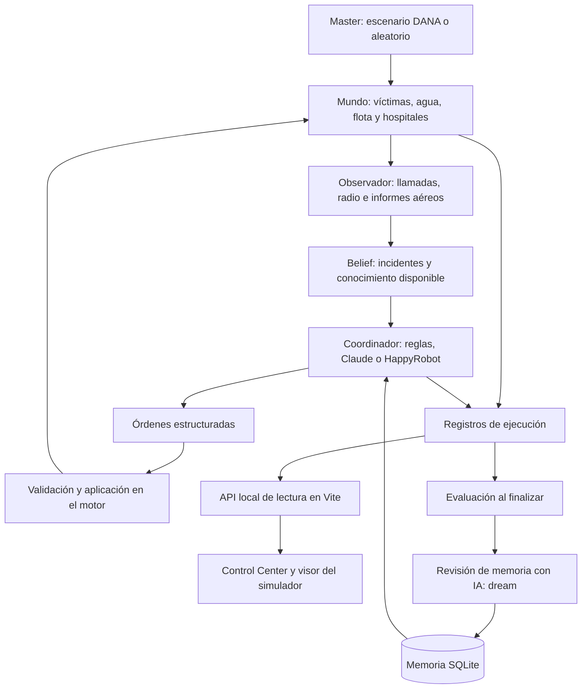

# ¿Puede una IA gestionar una catástrofe?

Proyecto de **HackSpain 2026**, desarrollado para el track de **HappyRobot**. Este proyecto combina un simulador de emergencias sobre el mapa real de Valencia, agentes de coordinación y un centro de control para observar sus decisiones.

El objetivo es estudiar cómo asignar recursos durante una DANA cuando las llamadas se acumulan, las carreteras dejan de ser transitables y la información llega incompleta. El coordinador debe decidir qué unidades enviar, a qué hospitales trasladar a las víctimas y cuándo buscar más información.

La idea central es que **una mejor decisión también depende de conseguir mejores datos**: contrastar llamadas, actualizar incidentes y enviar drones a zonas de las que nadie está informando.

## Qué incluye

| Parte | Responsabilidad |
| --- | --- |
| [`observatory/src/engine/`](docs/engine.md) y los agentes (`coordinators/`, `masters/`, `phone/`, `triage/`, `memory/`, `lab/`) | Motor principal: escenarios, inundaciones, víctimas, flota, observación parcial, coordinadores por reglas y por IA, evaluación y memoria. Incluye un visor propio (`observatory/viewer/`). |
| [`observatory/src/ui/`](observatory/README.md) y `observatory/server/` | **Alerta · Control Center**: incidencias, mapa operativo, hospitales, sala de decisión, políticas de escalado, balance de la noche y modo en vivo. Lee las ejecuciones del motor. |
| `observatory/src/live.ts` | **Modo en vivo**: la única sesión en marcha, las aprobaciones del operador y el webhook de la línea 112. |

Todo vive en un solo paquete, `observatory/`: un `package.json`, un lockfile y npm para todo.

## Arranque rápido: demo local sin credenciales

### Requisitos

- **Node.js 22.13 o posterior dentro de la rama 22, o Node.js 24.x.** El runner completo y el visor del motor utilizan `node:sqlite`; Node 20 no sirve para esos componentes.
- **npm**, que viene con Node. Ya no hace falta pnpm.
- Conexión para instalar dependencias y cargar las teselas del mapa. El grafo de calles de Valencia ya está incluido.

### 1. Obtener el repositorio

```sh
git clone https://github.com/sucara-hackspain/main.git sucara
cd sucara
```

Si ya tienes una copia, entra en su carpeta raíz. Si el repositorio requiere acceso, utiliza tu autenticación de GitHub.

### 2. Instalar el panel y generar una simulación

```sh
cd observatory
npm install
npm run data:local
npm run dev
```

Abre **http://127.0.0.1:5173/**. Selecciona la ejecución generada y usa **Ir al final** para explorar su estado final, o reproduce su línea temporal.

`data:local` ejecuta el motor de `observatory/` con el coordinador por reglas, semilla `2` y `120` etapas de 30 segundos: **una hora simulada**. Escribe los datos en `observatory/runs/`. Esta ruta no requiere instalar el paquete `observatory/`, configurar HappyRobot ni disponer de Claude CLI; tampoco inicializa la memoria persistente.

Para variar el escenario:

```sh
npm run data:local -- --seed 7 --ticks 240
```

## Arquitectura

El motor separa explícitamente **lo que sucede** de **lo que el coordinador sabe**.



**Stack:** TypeScript y Node.js para el motor y las herramientas; React, Vite y MapLibre GL para las interfaces; OpenStreetMap para el grafo viario; SQLite para la memoria; SDK de HappyRobot y Claude CLI como integraciones de coordinación. El núcleo de la simulación puede funcionar sin un modelo externo.

### 1. Un entorno de simulación para poner a prueba al agente

El escenario `DanaMaster` introduce emergencias y una inundación progresiva. `RandomMaster` permite ejecutar un escenario alternativo de incidentes aleatorios. En el motor principal estos generadores son código con aleatoriedad controlada por semilla.

Cada **tick equivale a 30 segundos simulados** y sigue este ciclo:

1. El master introduce escenas, cortes o averías.
2. El mundo avanza: las unidades se desplazan, las víctimas evolucionan y se realizan rescates, tratamientos y traslados.
3. El observador convierte los eventos en informes y actualiza el conocimiento disponible.
4. Si llegan informes nuevos, el coordinador recibe la situación y propone órdenes.
5. El motor aplica las órdenes válidas y registra sus efectos.

Las rutas se calculan sobre el grafo de calles mediante Dijkstra. Los cortes conocidos modifican la planificación; los desconocidos pueden descubrirse cuando una unidad se los encuentra.

### 2. Información parcial: el agente no es omnisciente

El estado real contiene la ubicación de las escenas, las lesiones, el tiempo restante de las víctimas y la extensión de la inundación. El agente toma decisiones a partir de un estado separado, `Belief`, construido con lo que se ha comunicado:

- **Llamadas al 112:** ubicación aproximada, qué ha ocurrido, consciencia, respiración, hemorragias y número estimado de afectados. Los testigos pueden equivocarse o desconocer detalles.
- **Radio de las dotaciones:** confirma ubicaciones, triaje, obstáculos y evolución de las intervenciones.
- **Informes aéreos:** aportan indicios sobre escenas, agua y carreteras cortadas, con errores y omisiones posibles.
- **Información de hospitales y mapas de inundación:** permite actualizar capacidades y estimar el avance del agua. Los mapas oficiales simulados llegan con retraso.

Varias llamadas pueden agruparse en un mismo incidente. La prioridad **P0–P3** se deduce de las señales conocidas; el triaje presencial utiliza las categorías **rojo, amarillo, verde y negro**. Los datos conservan referencias a sus fuentes para reconstruir por qué cambió una incidencia.

### 3. Coordinación mediante órdenes estructuradas

Los coordinadores comparten la interfaz `Coordinator.decide()`. Las implementaciones disponibles son:

| Coordinador | Cómo decide | Requisitos |
| --- | --- | --- |
| `greedy` | Reglas de prioridad, disponibilidad, capacidades y tiempos de llegada. Es la referencia de comparación. | Ejecución local. |
| `claude` | Envía un parte de situación a Claude CLI y solicita una respuesta ajustada a un esquema JSON. | Claude CLI instalado, autenticado y accesible como `claude`. |
| `happyrobot` | Envía el parte a un workflow de HappyRobot y consulta la salida estructurada de su nodo de decisión. | API key, workflow y `persistent_id` del nodo. |

Las herramientas descritas en la presentación se concretan en cuatro tipos de orden:

| Orden | Función |
| --- | --- |
| `dispatch` | Enviar una unidad a un incidente y, cuando corresponda, indicar el hospital de destino. |
| `transport` | Trasladar al hospital a una víctima que ya está a bordo. |
| `reposition` | Mover una unidad sin víctima a una nueva posición de espera. |
| `scout` | Enviar un dron o un helicóptero a reconocer una zona o un incidente. |

El parte incluye tiempos de llegada calculados por el motor. La respuesta del modelo se transforma en acciones del simulador; el motor comprueba si pueden ejecutarse y registra su aceptación o rechazo. Si una llamada al proveedor falla o agota el tiempo de espera, el coordinador utiliza el respaldo por reglas. La configuración obligatoria de HappyRobot debe existir antes de arrancar.

### 4. Recursos y búsqueda activa de información

| Recurso | Capacidad | Restricciones del modelo |
| --- | --- | --- |
| Ambulancia | Recoger y trasladar a una víctima. | Necesita una ruta por carretera y una cama disponible. |
| Bomberos | Liberar a personas atrapadas y atender casos leves. | No trasladan víctimas. |
| Rescate acuático | Liberar y trasladar; atravesar calles inundadas. | Desplazamiento más lento en el agua. |
| Helicóptero | Trasladar por aire o reconocer una zona. | Una víctima; entrega en hospitales con helipuerto. |
| Dron | Reconocer zonas, detectar indicios y comunicar obstáculos. | No rescata ni sustituye la confirmación de una dotación en tierra. |

Algunas escenas son **silenciosas**: no hay testigos, cobertura o personas capaces de llamar. El módulo `recon.ts` busca vacíos de información, como barrios que dejan de comunicar mientras el agua avanza o incidentes con una ubicación muy imprecisa. El parte presenta estas zonas en **LO QUE NO SABES** para orientar el reconocimiento.

Esta es la conexión técnica con la conclusión de la presentación: además de mejorar el razonamiento del agente, se busca mejorar la información con la que decide. El equipo describe que, en sus pruebas, añadir más reglas aportaba menos que disponer de información adicional. Es una **observación cualitativa de la demo**; esta copia no incluye una tabla de resultados que cuantifique esa comparación.

### 5. Atención telefónica del 112 y alcance de la integración

La presentación describe un equipo de agentes en HappyRobot para recibir emergencias y realizar llamadas de seguimiento a incidencias de baja prioridad, con un orquestador y un agente de triaje. También menciona incorporar información de redes sociales.

En este repositorio se puede inspeccionar y ejecutar:

- La generación de llamadas simuladas al 112 y sus actualizaciones en `observer.ts`.
- La agrupación, priorización y seguimiento de incidentes en `incidents.ts`.
- El coordinador conectado a HappyRobot y la sincronización de su prompt y esquema de salida.
- El reconocimiento con drones y el uso de información parcial.

**Los workflows completos de recepción y seguimiento telefónico, así como una integración con redes sociales, no están exportados en esta copia.** Levantar el repositorio reproduce el simulador y sus interfaces; esos flujos de la presentación requieren su configuración externa. El triaje de la simulación se calcula en el motor y no depende de desplegar el agente telefónico de la demo.

## Ejecutar el simulador completo

Desde la raíz del repositorio:

```sh
cd observatory
npm ci
npm run run-sim -- --coordinator greedy --seed 1 --ticks 120
```

El runner crea una carpeta en `observatory/runs/` y muestra el resultado en consola. Para seguir una ejecución con más tiempo entre etapas:

```sh
npm run run-sim -- --coordinator greedy --seed 7 --ticks 240 --tick-ms 300
```

`--tick-ms` añade una pausa real entre etapas; cada una sigue representando 30 segundos de simulación.

En otra terminal, abre uno de los visores:

```sh
# Control Center
cd observatory
npm run dev
```

```sh
# Visor del simulador, con la vista de memoria
cd observatory
npm run viewer
```

Ambos usan el puerto `5173` por defecto. Para abrirlos a la vez, arranca el Control Center con `npm run dev -- --port 5174` y deja el visor en `5173`.

### Usar Claude

Desde `observatory/`, con Claude CLI instalado y autenticado:

```sh
claude --version
npm run run-sim -- --coordinator claude --model haiku --seed 1 --ticks 120 --no-dream
```

`--model` selecciona el modelo que admite tu instalación de Claude CLI. `--no-dream` omite la revisión de memoria al terminar. Si ejecutas `npm run run-sim` sin indicar coordinador, el valor predeterminado es **Claude**, no `greedy`.

### Usar HappyRobot

Desde `observatory/`:

```sh
cp .env.example .env
```

Configura tus propios valores:

```dotenv
HAPPYROBOT_API_KEY=tu_api_key
HAPPYROBOT_CLUSTER=eu
HAPPYROBOT_WORKFLOW_ID=tu_workflow_id
HAPPYROBOT_NODE_ID=persistent_id_del_nodo_de_decision

# Opcionales: workflow de revisión de memoria
HAPPYROBOT_DREAM_WORKFLOW_ID=
HAPPYROBOT_DREAM_NODE_ID=
```

El workflow de coordinación debe tener un trigger con el campo `data` y un nodo de IA con salida estructurada. `HAPPYROBOT_NODE_ID` es el **`persistent_id`**, no el identificador del nodo específico de una versión. Los IDs incluidos en `.env.example` deben sustituirse por los de tu cuenta.

El repositorio incluye una herramienta para mantener el nodo alineado con el código:

```sh
npm run hr:sync -- --dry-run
npm run hr:sync
npm run run-sim -- --coordinator happyrobot --seed 1 --ticks 120 --no-dream
```

`hr:sync --dry-run` consulta la configuración sin modificarla. **`hr:sync` actualiza el prompt, la entrada y el esquema del nodo y publica la versión del workflow**; no crea el workflow desde cero. El contrato está en `src/coordinators/protocol.ts`: en HappyRobot, `actions` viaja como una cadena que contiene un array JSON.

## Modo en vivo: la demo

Una noche jugándose en directo, con una persona al mando. Dos procesos, en dos terminales, desde `observatory/`:

```sh
npm run dev      # el Control Center
npm run live     # la sesión en vivo y el webhook del 112 (:8112 llamadas, :8113 control, solo local)
```

En el Control Center, **Modo en vivo** → noche, quién coordina (el agente de HappyRobot o las reglas) y ritmo → **Empezar sesión en vivo**. Solo puede haber una sesión a la vez.

- **El operador aprueba.** Cuando salta una política de escalado en vigor, la noche se para hasta que decides; tu orden se ejecuta en el motor y queda en `runs/<sesión>/operator.jsonl`. El catálogo se edita en la pestaña **Políticas de escalado** y rige desde la siguiente sesión.
- **Llamadas reales al 112.** El workflow de voz de HappyRobot publica cada llamada en `/phone` al colgar (en local, a través de un túnel al 8112). La sesión se para y la llamada toma la pantalla: dónde es, qué dijo la persona y qué sacó el agente de voz. Entra en la noche cuando le das entrada.
- **Ensayar sin telefonear.** En el panel de Modo en vivo: *Ver cómo se ve una llamada* (sin sesión) o *Simular una llamada ahora* (con la sesión en marcha, por el mismo camino que una real).

Las grabaciones y cualquier otra ejecución solo se miran: no piden nada ni interrumpen.

## Evaluación, benchmark y memoria

### Comparar ejecuciones

Desde `observatory/`, la CLI ligera permite ejecutar varias semillas con la política por reglas:

```sh
npm run sim -- --seed 1 --ticks 240 --runs 20 --quiet
```

`sim` utiliza `greedy` y muestra resultados en consola; no genera las trazas que necesitan los visores. Para comparar coordinadores con trazas, usa `run-sim` con el mismo mapa, semilla, duración y recursos:

```sh
npm run run-sim -- --coordinator greedy --seed 7 --ticks 240
npm run run-sim -- --coordinator claude --model haiku --seed 7 --ticks 240 --no-memory --no-dream
npm run run-sim -- --coordinator happyrobot --seed 7 --ticks 240 --no-memory --no-dream
```

La semilla permite repetir la generación del escenario. Las decisiones del coordinador cambian su evolución y las respuestas de los modelos externos pueden variar. Mantén también fija la memoria si quieres aislar el efecto del coordinador.

El resumen recoge víctimas salvadas, fallecidas, pendientes o en traslado, tiempo medio de respuesta y métricas relacionadas con el agua. `survivalRate` se calcula como `saved / (saved + dead)`: **las víctimas todavía pendientes no entran en ese denominador**. El tiempo de respuesta se expresa en ticks, convertibles a segundos mediante `tickSeconds`.

### Memoria y revisión posterior a la ejecución

Los coordinadores de IA pueden consultar una doctrina de principios, heurísticas y errores previos almacenada como un grafo en **SQLite**:

1. Las reglas activas se incluyen antes del parte de situación.
2. Cada orden puede citar las reglas aplicadas mediante `applies`.
3. Al terminar, un evaluador analiza la realidad completa y atribuye causas a fallecimientos, desplazamientos fallidos y rescates.
4. Una fase denominada **dream** propone reforzar, debilitar, reescribir, añadir, fusionar o retirar reglas.
5. La consolidación conserva las evidencias y el historial; las nuevas reglas empiezan como candidatas.

La evaluación posterior puede ver información que el coordinador no tenía durante la ejecución. Este mecanismo modifica la memoria que se incorpora al prompt; **no entrena los pesos del modelo**.

```sh
# Volver a revisar una ejecución
npm run dream -- <id-de-ejecucion> --dry-run
npm run dream -- <id-de-ejecucion>

# Configurar el nodo del workflow de memoria ya creado
npm run hr:sync -- --dream --dry-run
npm run hr:sync -- --dream
```

El `--dry-run` de `dream` imprime la entrada que recibiría el modelo, sin llamarlo ni consolidar reglas; sí abre la base de memoria y registra el episodio evaluado. La revisión automática se activa al finalizar las ejecuciones con IA, salvo que se use `--no-dream` o `--no-memory`. Si no hay workflow de memoria configurado, utiliza Claude CLI; también puede recurrir a Claude si falla HappyRobot. El coordinador `greedy` no utiliza la doctrina ni lanza esta revisión por defecto.

### Archivos generados

| Ruta, relativa a `observatory/` | Contenido |
| --- | --- |
| `runs/<id>/meta.json` | Configuración, coordinador, estado y resumen de la ejecución. |
| `runs/<id>/ticks.jsonl` | Snapshot, eventos, informes y decisiones de cada etapa. |
| `runs/<id>/llm.jsonl` | Entradas y respuestas de las llamadas al modelo, cuando las hay. |
| `runs/<id>/run.log` | Registro legible del runner. |
| `runs/<id>/evaluation.json` | Evaluación posterior de `run-sim`. |
| `runs/<id>/dream.json` | Propuesta y cambios de memoria, cuando se completa esa fase. |
| `memory/memory.db` | Grafo persistente de reglas, episodios y evidencias. |
| `memory/MEMORY.md` | Vista generada de la memoria que consulta el agente. |

La ruta rápida `data:local` genera únicamente `meta.json` y `ticks.jsonl`, suficientes para el Control Center.

## Control Center y API de lectura

El panel permite revisar incidentes, unidades, hospitales, rutas y la evolución de la inundación. La vista **Realidad** muestra datos completos para supervisión; esa información no se añade por ello al conocimiento del coordinador.

La integración usa archivos locales y un middleware del servidor de desarrollo de Vite:

| Endpoint | Respuesta |
| --- | --- |
| `GET /api/runs` | Lista de ejecuciones y metadatos. |
| `GET /api/runs/:id?from=N` | Registros de una ejecución a partir del índice `N`. |
| `GET /api/graph/:map` | Grafo de calles y hospitales. |

La UI consulta periódicamente estos endpoints. **Play, pausa y la línea temporal controlan la reproducción del navegador**; no detienen el proceso que está ejecutando la simulación.

Las intervenciones del operador detectan excepciones y proponen respuestas a partir de los registros. Actualmente las decisiones se guardan en memoria del navegador y **no se envían al motor**. El motor ya expone `Simulation.order()` como punto de extensión para conectar ese control.

El Control Center soporta el contrato actual de unidades e incidentes de `observatory/`; las grabaciones antiguas con `frame.ambulances` o `patients` se rechazan explícitamente.

### Build

```sh
cd observatory
npm run build
```

La salida está en `observatory/dist/`. Para desplegarla hay que proporcionar también los endpoints de lectura: el build estático y `vite preview` no incluyen el middleware de desarrollo que sirve las ejecuciones.

## Estructura técnica

```text
observatory/
├── src/engine/                # Mundo, simulación, observación, incidentes, rutas y escalado
├── src/coordinators/          # Claude, HappyRobot y contrato de órdenes
├── src/masters/  src/phone/  src/triage/   # Quien decide la noche, la línea 112 y el triaje
├── src/memory/                # SQLite, evaluación y consolidación
├── src/lab/                   # Noches congeladas, benchmark y entrenamiento de la doctrina
├── src/run.ts                 # Runner con trazas y evaluación
├── src/live.ts                # Modo en vivo: sesión única, aprobaciones y webhook del 112
├── src/cli.ts                 # Simulaciones por reglas y múltiples semillas
├── src/ui/                    # Control Center: incidencias, mapa, decisiones, políticas, balance, en vivo
├── server/                    # API de lectura, políticas y paso hacia el modo en vivo
├── viewer/                    # Visor propio del motor y grafo de memoria
├── scripts/                   # Descarga de mapas y sincronización de workflows
├── tests/                     # Pruebas del motor, de datos y de navegador
├── data/  lab/  policies/  memory/  runs/   # Callejero, noches, catálogo de escalado, memoria y grabaciones
└── docs/data-integration.md   # Contrato de integración
deploy/preview/                # El stack del VPS
docs/engine.md                 # El simulador a fondo
```

Para añadir otro coordinador, implementa `Coordinator.decide()`; para introducir otro generador de escenarios, implementa `Master.act()`. La configuración del mundo está en `observatory/src/engine/engine.ts` y sus contratos en `types.ts`.

## Pruebas

Desde la raíz del repositorio, después de `npm ci` en `observatory/`:

```sh
cd observatory
npm test              # modelos de datos del Control Center
npm run test:engine   # motor, memoria, escalado y coordinadores
npm run typecheck
npm run build
npm run test:ui       # navegador (Playwright)
```

Las pruebas de navegador utilizan Playwright con el canal `chrome`, por lo que necesitan Google Chrome instalado. Para utilizar un puerto independiente: `PLAYWRIGHT_PORT=5180 npm run test:ui`. Las pruebas de UI usan escenarios locales y no requieren llamadas a modelos reales.

## Problemas habituales

| Síntoma | Qué comprobar |
| --- | --- |
| El panel no muestra ejecuciones | Ejecuta `npm run data:local` o `npm run run-sim` desde `observatory/`. `npm run sim` solo imprime resultados. |
| Error con `node:sqlite` | Revisa `node --version` y cambia a una versión de Node compatible con los requisitos. |
| No aparece el mapa de fondo | Comprueba la conexión a las teselas de OpenFreeMap y la consola del navegador. |
| Error de formato al abrir una ejecución | Genera una nueva grabación: los contratos antiguos no se convierten automáticamente. |
| El puerto `5173` está ocupado | Usa otro puerto, por ejemplo `npm run dev -- --port 5174`. |
| La ejecución usa `FALLBACK` | Revisa `run.log` y `llm.jsonl`: puede haber un error, timeout o salida inválida del proveedor. |
| Falla HappyRobot al arrancar | Comprueba la API key, el cluster, el workflow publicado y el `persistent_id` del nodo. |
| La interfaz compilada carga, pero no recibe datos | Proporciona los endpoints `/api/runs` y `/api/graph`; no se incluyen en el build estático. |

## Estado del proyecto

Alerta es un prototipo de simulación y experimentación del hackathon. La evolución de víctimas, el agua y los tiempos de operación son modelos simplificados; los resultados describen el comportamiento dentro de ese entorno. La telefonía externa de la presentación y la conexión de las órdenes del operador al motor requieren integración adicional.

Para profundizar: [motor y memoria](docs/engine.md), [Control Center](observatory/README.md) y [contrato de datos](observatory/docs/data-integration.md).