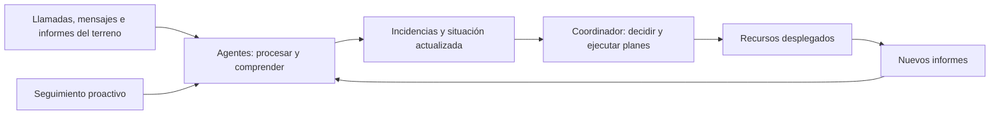

# SUCARA

**Software de gestión de crisis con agentes de IA.**

HackSpain 2026 · Track HappyRobot

SUCARA procesa grandes volúmenes de información en paralelo, los comprende con rapidez y los convierte en decisiones para gestionar una crisis. Sus agentes reciben avisos, mantienen actualizada la situación y coordinan los recursos disponibles para responder.

El sistema está diseñado para adaptarse a distintos tipos de crisis. Las fuentes de información, los recursos y los planes de actuación cambian con cada escenario. **Para la demo hemos elegido una crisis natural: la DANA de Valencia de 2024.**

## Comprender lo que está pasando, a tiempo

Durante una crisis, la información llega fragmentada y cambia continuamente. Hay llamadas que atender, mensajes que interpretar y equipos que comunican novedades desde el terreno. Cada conversación y cada comprobación requieren tiempo, mientras siguen entrando nuevos avisos.

SUCARA amplía esa capacidad de atención mediante agentes que pueden procesar información de distintas fuentes en paralelo. El valor está en **comprender qué significa cada aviso, relacionarlo con lo que ya sabemos y detectar cuándo cambia una situación**. Una imagen más completa y actualizada de la crisis permite tomar mejores decisiones.

Las fuentes que exploramos incluyen llamadas de emergencia, redes sociales, observaciones de drones e informes de las dotaciones. También buscamos información de forma activa: volver a contactar con una persona permite saber si su situación ha empeorado desde el primer aviso.

## Un coordinador que puede actuar

El agente coordinador utiliza esa información para **priorizar la respuesta, asignar recursos y ejecutar planes mediante herramientas**. En el escenario de la demo, puede desplegar ambulancias, bomberos y otros medios de rescate, o enviar drones para reconocer una zona.

Decide con información parcial: conoce lo que le reportan las personas y los equipos. Si una ambulancia encuentra un obstáculo o una nueva llamada revela una emergencia más grave, el coordinador dispone de nuevos datos para revisar su actuación.



## El 112 con HappyRobot

Con HappyRobot hemos automatizado un **equipo de atención telefónica de emergencias**. Este módulo se ocupa de dos actividades:

- **Recibir emergencias:** atender las llamadas de las personas afectadas y recoger la información necesaria para incorporar sus incidencias a la gestión de la crisis.
- **Hacer seguimiento:** volver a llamar a personas con incidencias de menor prioridad para comprobar que siguen estables y detectar si necesitan una respuesta más urgente.

La capacidad de realizar estas tareas en paralelo permite continuar el seguimiento de los casos abiertos mientras se reciben nuevos avisos. Una incidencia que inicialmente parecía leve puede cambiar de prioridad a partir de lo que descubrimos en la siguiente llamada.

Un **agente de triaje** clasifica las incidencias por prioridad y un **orquestador** coordina la ejecución de los agentes de atención. El coordinador de recursos recibe así información que se actualiza durante la crisis y puede ajustar su respuesta.

## Poner a prueba las decisiones

Para evaluar el sistema construimos un **entorno de simulación y un benchmark con distintos escenarios de crisis**. Nos permiten observar las consecuencias de las decisiones del coordinador y comparar estrategias y heurísticas de razonamiento bajo información parcial. En los escenarios de emergencia, el objetivo es reducir el número de fallecidos.

En nuestras pruebas, añadir más reglas al agente no produjo una mejora clara frente a su comportamiento con pocas instrucciones. **Lo que marcó la diferencia fue disponer de más información para decidir.** Ese aprendizaje orientó el desarrollo hacia ampliar las fuentes, la recepción de llamadas y el seguimiento continuo.

La simulación proporciona una realidad conocida con la que contrastar las decisiones, mientras el coordinador solo ve lo que le comunican sus fuentes. Así podemos estudiar cómo responde ante información incompleta y qué cambia al mejorarla.

## La demo: DANA de Valencia de 2024

Durante la DANA quedaron **40.000 llamadas sin atender en 48 horas**. Este caso ilustra el problema que queremos abordar: una crisis puede generar más información y peticiones de ayuda de las que los equipos alcanzan a procesar a tiempo.


<sub>elDiario.es · Recorte aportado por el equipo.</sub>

La demo utiliza el callejero de Valencia para representar una inundación con incidentes, cortes de calles y recursos de emergencia. El **Control Center** permite seguir la evolución, consultar incidencias y unidades, y revisar la secuencia de avisos y decisiones.

El proyecto está en fase de prototipo y su evaluación se realiza en simulación. Las decisiones manuales del operador se registran en el panel; su envío al motor está pendiente de integración.

## Cómo levantar el proyecto

### Arranque local

Necesitas **Node.js 22.13 o superior y npm**. Con el repositorio clonado, ejecuta desde su raíz:

```sh
cd crisis-observatory
npm ci
npm run data:local
npm run dev
```

Abre **[http://localhost:5173](http://localhost:5173)** y selecciona la ejecución generada. Puedes reproducirla y explorar el mapa y las incidencias.

Este arranque utiliza un coordinador por reglas y funciona sin claves de API. `data:local` genera 120 pasos y guarda la ejecución en `gabriel/runs/`. Solo necesitas instalar las dependencias de `crisis-observatory/`; el mapa de Valencia está incluido y las teselas se cargan por Internet.

### Conectar los agentes de HappyRobot

Necesitas **pnpm 10**, una clave de API y acceso a los workflows de HappyRobot. Mantén el panel abierto y, en otra terminal, ejecuta desde la raíz del repositorio:

```sh
cd gabriel
pnpm install --frozen-lockfile
cp .env.example .env
```

Configura en `gabriel/.env` las variables `HAPPYROBOT_API_KEY`, `HAPPYROBOT_CLUSTER`, `HAPPYROBOT_WORKFLOW_ID` y `HAPPYROBOT_NODE_ID`. Los identificadores de ejemplo corresponden a los workflows del hackathon: utiliza los de tu entorno.

Desde `gabriel/`, inicia una ejecución con el coordinador de HappyRobot:

```sh
pnpm run-sim --coordinator happyrobot --ticks 120 --tick-ms 1000 --no-dream
```

La ejecución aparecerá en el selector del Control Center. El intervalo de un segundo entre pasos permite seguirla mientras avanza; `--no-dream` omite el proceso adicional de consolidación de memoria al terminar.

Para activar otros módulos, configura sus workflows y añade las opciones correspondientes:

| Opción | Qué activa |
| --- | --- |
| `--desk happyrobot` | Generación de llamadas simuladas y triaje con agentes. |
| `--phone` | Recepción desde la línea de voz de HappyRobot y llamadas de seguimiento. |
| `--master happyrobot` | Un agente que genera los acontecimientos del escenario. |

Las variables de cada módulo están en [`.env.example`](gabriel/.env.example), y su configuración se detalla en la [documentación del motor y las integraciones](gabriel/README.md).

### Estructura del repositorio

| Carpeta | Contenido |
| --- | --- |
| [`crisis-observatory/`](crisis-observatory/README.md) | Control Center y API local que lee las ejecuciones. |
| [`gabriel/`](gabriel/README.md) | Coordinadores, integración HappyRobot, simulador y laboratorio de evaluación. Las ejecuciones se guardan en `gabriel/runs/`. |
| [`backend/`](backend/README.md) | Simulador independiente por CLI; el panel utiliza el motor de `gabriel/`. |
| [`deploy/preview/`](deploy/preview/README.md) | Configuración de despliegue en VPS con Docker y Caddy. |

Si el panel está esperando datos, ejecuta `npm run data:local` desde `crisis-observatory/`. Si el puerto 5173 está ocupado, abre la dirección alternativa que indique Vite en la terminal.
