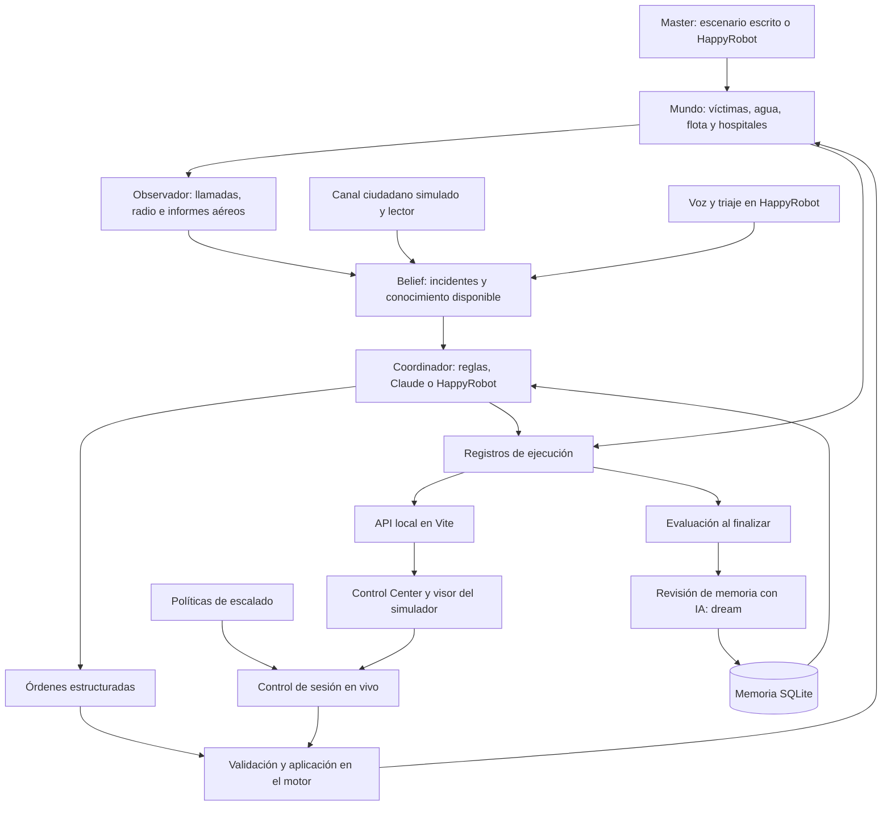

# ¿Puede una IA gestionar una catástrofe?

Proyecto de **HackSpain 2026**, desarrollado para el track de **HappyRobot**. Combina un simulador de emergencias sobre el callejero real de Valencia, agentes de coordinación, atención telefónica y un centro de control desde el que observar e intervenir en una sesión en vivo.

El objetivo es estudiar cómo asignar recursos durante una DANA cuando las llamadas se acumulan, las carreteras dejan de ser transitables y la información llega incompleta. El coordinador debe decidir qué unidades enviar, a qué hospitales trasladar a las víctimas y cuándo buscar más información.

La idea central es que **una mejor decisión también depende de conseguir mejores datos**: contrastar llamadas, actualizar incidentes, interpretar mensajes ciudadanos y enviar drones a zonas de las que nadie está informando. El laboratorio permite estudiar por separado el efecto del razonamiento, la planificación y la información disponible.

## Qué incluye

| Parte | Responsabilidad |
| --- | --- |
| [`observatory/src/engine/`](docs/engine.md) y agentes | Motor, coordinación, telefonía, triaje, evaluación y memoria. |
| [`observatory/src/ui/`](observatory/README.md) y `server/` | **Control Center**: mapa, incidencias, hospitales, políticas, intervenciones y balance. |
| `observatory/src/live.ts` | Sesión en vivo, entrada de llamadas y decisiones del operador. |
| `observatory/src/lab/` y `observatory/lab/` | Experimentos, escenarios, lecturas del canal ciudadano y resultados. |
| [`deploy/preview/`](deploy/preview/README.md) | Imagen Docker y despliegue de la demo. |

Todo vive en **un único paquete, `observatory/`**, con un `package.json`, un `package-lock.json` y npm para todos los comandos. El visor alternativo del motor está en `observatory/viewer/`.

## Arranque rápido: demo local sin credenciales

### Requisitos

- **Node.js 22.13 o posterior dentro de la rama 22, o Node.js 24.x.** El runner completo y el visor de `observatory/` utilizan `node:sqlite`; Node 20 no sirve para esos componentes.
- **npm**, incluido con Node.js. La instalación se realiza una sola vez dentro de `observatory/`.
- Conexión para instalar dependencias y cargar las teselas del mapa. El grafo de calles de Valencia ya está incluido.

### 1. Obtener el repositorio

```sh
git clone https://github.com/sucara-hackspain/main.git sucara
cd sucara
```

Si ya tienes una copia, entra en su carpeta raíz. Si el repositorio requiere acceso, utiliza tu autenticación de GitHub.

### 2. Instalar el panel y generar una simulación

```sh
cd observatory
npm ci
npm run data:local
npm run dev
```

Abre **http://127.0.0.1:5173/**. Selecciona la ejecución generada y usa **Ir al final** para explorar su estado final, o reproduce su línea temporal.

`data:local` ejecuta el motor de `observatory/` con el coordinador por reglas, semilla `2` y `120` etapas de 30 segundos: **una hora simulada**. Escribe los datos en `observatory/runs/`. Esta ruta utiliza la instalación anterior, no necesita credenciales de HappyRobot ni Claude CLI y no inicializa la memoria persistente.

En esta versión, `data:local` tiene la semilla y la duración fijadas en su código: no interpreta `--seed` ni `--ticks`. Para ejecutar una noche del laboratorio con canal ciudadano y balance final, desde la raíz:

```sh
cd observatory
npm run lab:demo -- H1 agente
```

La grabación `demo-H1-agente` aparecerá en el mismo selector del panel. El coordinador es por reglas y la lectura del canal ciudadano se recupera de `lab/readings/H1.json`, ya incluido: este comando no llama a HappyRobot ni a Claude. También admite `sala`, `palabras`, `perfecto` y `ninguno` como segundo argumento. Ejecutarlo otra vez con la misma combinación sustituye esa grabación.

### 3. Probar el modo en vivo

Con las dependencias instaladas, abre dos terminales desde la raíz:

```sh
# Terminal 1: proceso que controla la sesión
cd observatory
npm run live
```

```sh
# Terminal 2: panel
cd observatory
npm run dev
```

En **Modo en vivo**, elige una noche, selecciona **Reglas** para probar sin credenciales, fija el ritmo y pulsa **Empezar sesión en vivo**. Puede haber una sola sesión activa. Si mantienes habilitada la aprobación del operador, la simulación se detendrá cuando una política escale una situación o llegue una llamada que deba revisarse.

El proceso usa `8112` para el webhook telefónico y `8113` para el control local. Puedes cambiarlos con `LIVE_PHONE_PORT` y `LIVE_CONTROL_PORT`; el panel debe recibir el mismo `LIVE_CONTROL_PORT` si lo modificas. **Simular una llamada ahora** permite ensayar el flujo sin hacer una llamada telefónica. En una copia sin `.env`, `npm run live` funciona sin línea de HappyRobot; si configuras la línea, empieza a consultar sus llamadas.

## Arquitectura

El motor separa explícitamente **lo que sucede** de **lo que el coordinador sabe**.



**Stack:** TypeScript y Node.js para el motor y las herramientas; React, Vite y MapLibre GL para las interfaces; OpenStreetMap para el grafo viario; SQLite para la memoria; SDK de HappyRobot y Claude CLI para los agentes. La búsqueda semántica de políticas utiliza Transformers.js en un Web Worker. El núcleo de la simulación puede funcionar sin un modelo externo.

### 1. Un entorno de simulación para poner a prueba al agente

El escenario `DanaMaster` introduce emergencias y una inundación progresiva. `RandomMaster` genera incidentes aleatorios y `ScriptedMaster` reproduce las noches versionadas del laboratorio. Estos escenarios permiten repetir situaciones con distintos coordinadores.

Con `--master happyrobot`, otro agente decide qué le ocurre a la ciudad: escenas, inundaciones, cortes y averías. Sus propuestas se traducen a entidades del mapa y se registran en `master.jsonl`. Su narración se muestra al supervisor, pero no se entrega al coordinador como conocimiento del mundo.

Cada **tick equivale a 30 segundos simulados** y sigue este ciclo:

1. El master introduce escenas, cortes o averías.
2. El mundo avanza: las unidades se desplazan, las víctimas evolucionan y se realizan rescates, tratamientos y traslados.
3. El observador convierte los eventos en informes y actualiza el conocimiento disponible.
4. El coordinador procesa las novedades y propone órdenes; las integraciones asíncronas incorporan sus respuestas cuando están disponibles.
5. El motor aplica las órdenes válidas, registra sus efectos y evalúa qué situaciones requieren al operador.

En `run-sim`, HappyRobot decide en segundo plano, por defecto cada seis ticks (`--decide-every`), acumulando novedades. El mundo continúa mientras responde y las órdenes se contrastan con el estado en el que aterrizan. El laboratorio y el modo en vivo basado en sus escenarios esperan las decisiones del coordinador para mantenerlas ligadas a su etapa. La mesa de triaje y el generador de llamadas de `--desk happyrobot` también trabajan en segundo plano.

Las rutas se calculan sobre el grafo de calles mediante Dijkstra. Los cortes conocidos modifican la planificación; los desconocidos pueden descubrirse cuando una unidad se los encuentra.

### 2. Información parcial: el agente no es omnisciente

El estado real contiene la ubicación de las escenas, las lesiones, el tiempo restante de las víctimas y la extensión de la inundación. El agente toma decisiones a partir de un estado separado, `Belief`, construido con lo que se ha comunicado:

- **Llamadas al 112:** ubicación aproximada, qué ha ocurrido, consciencia, respiración, hemorragias y número estimado de afectados. Los testigos pueden equivocarse o desconocer detalles.
- **Radio de las dotaciones:** confirma ubicaciones, triaje, obstáculos y evolución de las intervenciones.
- **Informes aéreos:** aportan indicios sobre escenas, agua y carreteras cortadas, con errores y omisiones posibles.
- **Información de hospitales y mapas de inundación:** permite actualizar capacidades y estimar el avance del agua. Los mapas oficiales simulados llegan con retraso.
- **Canal ciudadano simulado:** mensajes de redes, WhatsApp e IoT, mezclados con ruido, bromas y rumores. Un lector decide qué merece convertirse en una pista.
- **Datos preventivos, cuando el escenario los incluye:** aforos del agua, cortes eléctricos y un registro de residencias, colegios o garajes donde todavía hay personas que pueden ponerse a salvo.

Varias llamadas pueden agruparse en un mismo incidente. La prioridad **P0–P3** se deduce de las señales conocidas; el triaje presencial utiliza las categorías **rojo, amarillo, verde y negro**. Los datos conservan referencias a sus fuentes para reconstruir por qué cambió una incidencia.

### 3. Coordinación mediante órdenes estructuradas

Los coordinadores comparten la interfaz `Coordinator.decide()`. Las implementaciones disponibles son:

| Coordinador | Cómo decide | Requisitos |
| --- | --- | --- |
| `greedy` | Reglas de prioridad, disponibilidad, capacidades y tiempos de llegada. Es la referencia de comparación. | Ejecución local. |
| `claude` | Envía un parte de situación a Claude CLI y solicita una respuesta ajustada a un esquema JSON. | Claude CLI instalado, autenticado y accesible como `claude`. |
| `happyrobot` | Envía el parte a un workflow de HappyRobot y consulta la salida estructurada de su nodo de decisión. | API key, workflow y `persistent_id` del nodo. |

El contrato actual incluye órdenes de respuesta y de anticipación:

| Orden | Función |
| --- | --- |
| `dispatch` | Enviar una unidad a un incidente y, cuando corresponda, indicar el hospital de destino. |
| `transport` | Trasladar al hospital a una víctima que ya está a bordo. |
| `reposition` | Mover una unidad a un hospital, un punto de espera por delante del agua o un lugar con personas que evacuar. |
| `scout` | Enviar un dron o un helicóptero a reconocer una zona o un incidente. |
| `warn` | Avisar a un lugar registrado para que empiece a ponerse a salvo. Es una acción de la simulación. |
| `hold` / `release` | Reservar una unidad para una necesidad concreta y liberar esa reserva. |

HappyRobot conserva además un **cuaderno de sesión**: `plan` resume lo que intenta conseguir y `watch` lo que está vigilando. El siguiente parte recupera ese cuaderno y el estado de sus órdenes anteriores. Las reservas se mantienen en la capa del coordinador, mientras que las acciones de movimiento y aviso se aplican en el motor. Esta memoria de trabajo es distinta de la doctrina persistente en SQLite.

El parte incluye tiempos de llegada calculados por el motor. La respuesta del modelo se transforma en acciones del simulador; el motor comprueba si pueden ejecutarse y registra su aceptación o rechazo. Si una llamada al proveedor falla o agota el tiempo de espera, el coordinador utiliza el respaldo por reglas. La configuración obligatoria de HappyRobot debe existir antes de arrancar.

### 4. Recursos y búsqueda activa de información

| Recurso | Capacidad | Restricciones del modelo |
| --- | --- | --- |
| Ambulancia | Recoger y trasladar a una víctima. | Necesita una ruta por carretera y una cama disponible. |
| Bomberos | Liberar a personas atrapadas y atender casos leves. | No trasladan víctimas. |
| Rescate acuático | Liberar y trasladar; atravesar calles inundadas. | Desplazamiento más lento en el agua. |
| Helicóptero | Trasladar por aire o reconocer una zona. | Una víctima; entrega en hospitales con helipuerto. |
| Dron | Reconocer zonas, detectar indicios y comunicar obstáculos. | No rescata ni sustituye la confirmación de una dotación en tierra. |

Algunas escenas son **silenciosas**: no hay testigos, cobertura o personas capaces de llamar. El módulo `recon.ts` busca vacíos de información, como barrios que dejan de comunicar mientras el agua avanza o incidentes con una ubicación muy imprecisa. El parte presenta estas zonas en **LO QUE NO SABES** para orientar el reconocimiento.

El canal ciudadano amplía esa búsqueda: `signals.ts` genera mensajes sobre la misma realidad del escenario y `reading.ts` permite compararlos con una sala de atención limitada, filtros por palabras clave, lecturas de un modelo guardadas en disco y una referencia con acceso a la clasificación real. Las pistas se contrastan con un registro de personas vulnerables y llegan al coordinador como nuevos avisos. Algunos perfiles incorporan también llamadas simuladas para averiguar qué ocurre en zonas silenciosas.

La capacidad de anticipación se prueba con lugares que pueden evacuar antes de inundarse, unidades situadas en puntos de espera y recursos reservados. Es la conexión con la conclusión de la presentación: mejorar el razonamiento importa, pero también lo que el agente alcanza a saber y lo que puede hacer antes de que ocurra una emergencia. El repositorio incluye ahora escenarios y resultados para investigar ambas cuestiones.

### 5. Atención telefónica del 112, triaje y seguimiento

La integración distingue varios papeles, conectados con el mismo registro de incidentes:

| Agente o flujo | Papel en el sistema |
| --- | --- |
| Voz entrante del 112 | Recibe una llamada en el número configurado en HappyRobot y produce un objeto `Call` al terminar. |
| `112-coordinator` | Genera lotes de llamadas sintéticas para probar la mesa; pese al nombre, no es el coordinador que mueve la flota. |
| `112-triage` | Evalúa cada llamada contra el tablero de incidentes y propone su agrupación y prioridad. |
| `112-outbound` | Llama de vuelta para comprobar la evolución de un caso y devuelve un parte de seguimiento. |
| `sim-112` | Redacta el texto de una llamada a partir de los hechos del motor, cuando se activa `--calls happyrobot`. |

Con `--desk happyrobot`, el generador y el triaje procesan llamadas en segundo plano. El motor conserva su agrupación espacial de incidentes y toma la prioridad del agente como un mínimo de urgencia hasta que una dotación presencial aporta información más fiable.

Con `--phone`, el runner incorpora llamadas reales del workflow de voz mediante **webhook y sondeo de ejecuciones**. `Simulation.phone()` busca la calle indicada, crea la emergencia correspondiente dentro del mundo simulado y entrega el aviso al coordinador. La deduplicación evita registrar dos veces una llamada recibida por ambas vías.

En este runner, las llamadas con número de retorno y prioridad baja o media pueden activar seguimiento después de `--followup-after` ticks, por defecto diez. Si no hay respuesta se permite un reintento; si hay empeoramiento o señales de alarma se eleva la urgencia, o se reabre el caso mediante una nueva llamada si ya estaba cerrado. El flujo queda registrado en `followups.jsonl`.

**Alcance:** el código de integración de voz, triaje y seguimiento está incluido; los workflows publicados y los números telefónicos se configuran en HappyRobot. El canal de redes sociales, WhatsApp e IoT del laboratorio es sintético, no un conector a cuentas reales. El seguimiento telefónico real corresponde a `run-sim --phone`; `npm run live` incorpora llamadas entrantes y el canal ciudadano, pero no instancia ese servicio de llamadas de retorno.

## Ejecutar el simulador completo

`run-sim` permite configurar libremente semilla, duración, recursos e integraciones. **En esta versión inicializa el cliente de triaje de HappyRobot aunque `--desk` esté desactivado**, por lo que necesita `HAPPYROBOT_API_KEY` también con `greedy` o `claude`. Para ejecutar sin claves, usa `data:local`, `lab:demo`, `npm run sim` o el modo en vivo con reglas.

Desde la raíz del repositorio, con la clave configurada en `observatory/.env`:

```sh
cd observatory
npm run run-sim -- --coordinator greedy --seed 1 --ticks 120
```

El runner crea una carpeta en `observatory/runs/` y muestra el resultado en consola. Con `greedy`, sin mesa, voz ni master externo, el cliente de triaje se inicializa pero no hace peticiones. Para seguir una ejecución con más tiempo entre etapas:

```sh
npm run run-sim -- --coordinator greedy --seed 7 --ticks 240 --tick-ms 300
```

`--tick-ms` añade una pausa real entre etapas; cada una sigue representando 30 segundos de simulación.

En otra terminal, abre uno de los visores:

```sh
# Desde la raíz: Control Center
cd observatory
npm run dev
```

```sh
# Desde la raíz: visor del simulador, con la vista de memoria
cd observatory
npm run viewer
```

Ambos usan el puerto `5173` por defecto. Para abrirlos a la vez, arranca el Control Center con `npm run dev -- --port 5174` y deja el visor en `5173`.

### Usar Claude

Desde `observatory/`, con Claude CLI instalado y autenticado, y atendiendo al requisito actual de `HAPPYROBOT_API_KEY` del runner:

```sh
claude --version
npm run run-sim -- --coordinator claude --model haiku --seed 1 --ticks 120 --no-dream
```

`--model` selecciona el modelo que admite tu instalación de Claude CLI. `--no-dream` omite la revisión de memoria al terminar. Si ejecutas `npm run run-sim` sin indicar coordinador, el valor predeterminado es **Claude**, no `greedy`.

### Usar HappyRobot

Desde `observatory/`:

```sh
cp .env.example .env
```

Configura tus propios valores:

```dotenv
HAPPYROBOT_API_KEY=tu_api_key
HAPPYROBOT_CLUSTER=eu
HAPPYROBOT_WORKFLOW_ID=tu_workflow_id
HAPPYROBOT_NODE_ID=persistent_id_del_nodo_de_decision

# Opcionales: workflow de revisión de memoria
HAPPYROBOT_DREAM_WORKFLOW_ID=
HAPPYROBOT_DREAM_NODE_ID=
```

El workflow de coordinación debe tener un trigger con el campo `data` y un nodo de IA con salida estructurada. `HAPPYROBOT_NODE_ID` es el **`persistent_id`**, no el identificador del nodo específico de una versión. Los IDs incluidos en `.env.example` deben sustituirse por los de tu cuenta.

El repositorio incluye una herramienta para mantener el nodo alineado con el código:

```sh
npm run hr:sync -- --dry-run
npm run hr:sync
npm run run-sim -- --coordinator happyrobot --seed 1 --ticks 120 --tick-ms 2000 --no-dream
```

`hr:sync --dry-run` consulta la configuración sin modificarla. **`hr:sync` actualiza el prompt, la entrada y el esquema del nodo y publica la versión del workflow**; no crea el workflow desde cero. El contrato está en `src/coordinators/protocol.ts`: en HappyRobot, `actions` viaja como una cadena que contiene un array JSON.

Con este coordinador, dale tiempo real al runner mediante `--tick-ms`: sin pausa puede terminar la simulación antes de que regresen las decisiones asíncronas. El modo en vivo permite elegir ese ritmo desde la interfaz.

### Activar el master, la mesa del 112 y la línea de voz

Completa en `observatory/.env` los pares de workflow y nodo de las funciones que quieras activar:

| Función | Variables adicionales |
| --- | --- |
| Master de escenarios | `HAPPYROBOT_MASTER_WORKFLOW_ID`, `HAPPYROBOT_MASTER_NODE_ID` |
| Redacción de llamadas sintéticas | `HAPPYROBOT_CALLS_WORKFLOW_ID`, `HAPPYROBOT_CALLS_NODE_ID`; opcionalmente `HAPPYROBOT_CALLS_ENVIRONMENT` |
| Triaje | `HAPPYROBOT_TRIAGE_WORKFLOW_ID`, `HAPPYROBOT_TRIAGE_NODE_ID` |
| Generación de llamadas | `HAPPYROBOT_GENERATOR_WORKFLOW_ID`, `HAPPYROBOT_GENERATOR_NODE_ID` |
| Línea de voz entrante | `HAPPYROBOT_PHONE_WORKFLOW_ID`, `HAPPYROBOT_PHONE_NODE_ID` |
| Llamadas de seguimiento | `HAPPYROBOT_OUTBOUND_WORKFLOW_ID`, `HAPPYROBOT_OUTBOUND_NODE_ID` |

Algunas integraciones tienen IDs predeterminados del hackathon. Sustitúyelos por los de tus workflows si trabajas en otra cuenta. Los nodos se identifican por su `persistent_id`.

```sh
# Desde observatory/: master, coordinación y mesa con agentes
npm run run-sim -- --coordinator happyrobot --master happyrobot --desk happyrobot --ticks 180 --tick-ms 2000 --no-dream

# Añadir voz entrante y seguimiento; necesita los workflows telefónicos configurados
npm run run-sim -- --coordinator happyrobot --phone --ticks 180 --tick-ms 2000 --followup-after 10 --no-dream
```

`--phone-port` controla el puerto del webhook, por defecto `8112`; con `0` se utiliza únicamente el sondeo. `--phone-since` permite incluir llamadas terminadas unos minutos antes del inicio. Los intervalos de coordinación, generación y triaje se ajustan con `--decide-every`, `--desk-every` y `--triage-every`.

Para recibir webhooks desde HappyRobot, la máquina necesita una URL accesible mediante un túnel o el despliegue. El script `npm run hr:phone -- https://tu-dominio-de-demo.example` configura las rutas `/phone` y `/followup` y **publica los workflows afectados**; sustituye esa URL por la real. `npm run hr:sync -- --master` sincroniza y publica el master. Los scripts `hr:generator` y `hr:triage` son herramientas específicas para ajustar, publicar y probar los workflows de la demo, no pasos obligatorios del arranque local.

No ejecutes `npm run live` y un `run-sim --phone` con el mismo puerto: son dos procesos distintos que intentarían recibir la misma línea.

## Evaluación, benchmark y memoria

### Comparar ejecuciones

Desde `observatory/`, la CLI ligera permite ejecutar varias semillas con la política por reglas:

```sh
npm run sim -- --seed 1 --ticks 240 --runs 20 --quiet
```

`sim` utiliza `greedy` y muestra resultados en consola; no genera las trazas que necesitan los visores. `run-sim` permite estudiar ejecuciones con trazas y una configuración equivalente:

```sh
npm run run-sim -- --coordinator greedy --seed 7 --ticks 240
npm run run-sim -- --coordinator claude --model haiku --seed 7 --ticks 240 --no-memory --no-dream
npm run run-sim -- --coordinator happyrobot --seed 7 --ticks 240 --tick-ms 2000 --no-memory --no-dream
```

La semilla permite repetir la generación del escenario, pero el ritmo y la latencia importan en el runner asíncrono. Para comparar políticas de forma controlada, el laboratorio reproduce los mismos guiones y espera las decisiones del agente. Mantén fijos también los recursos, la memoria y los canales de información.

El resumen recoge víctimas salvadas, fallecidas, pendientes o en traslado, tiempo medio de respuesta y métricas relacionadas con el agua. `survivalRate` se calcula como `saved / (saved + dead)`: **las víctimas todavía pendientes no entran en ese denominador**. El tiempo de respuesta se expresa en ticks, convertibles a segundos mediante `tickSeconds`.

### Laboratorio: qué aporta el razonamiento y qué aporta la información

`observatory/lab/scenarios/` contiene **30 noches**, repartidas en entrenamiento, validación y test. El laboratorio permite investigar tres cambios por separado:

| Experimento | Qué compara | Comando desde `observatory/` |
| --- | --- | --- |
| Atención e información | Solo avisos tradicionales, sala con lectura limitada, palabras clave, lectura del agente y referencia con clasificación real. | `npm run lab:attention -- H1` |
| Planificación | Reglas, reglas con datos preventivos, agente reactivo y agente con cuaderno, reservas y puntos de espera. | `npm run lab:ab -- --only A1 --reps 1 --parallel 2` |
| Doctrina | Un investigador propone cambios de reglas, los evalúa y comprueba su efecto en noches de validación. | `npm run lab -- --generations 1 --parallel 2` |

La comparación de atención usa lecturas ya guardadas y **no llama a modelos durante las partidas**. `npm run lab:read -- H1` utiliza Claude CLI para generar una lectura si hace falta. La variante de agente también puede activar llamadas simuladas de búsqueda: sus diferencias incluyen esa capacidad, no únicamente la comprensión del texto.

El A/B de planificación necesita HappyRobot; el ciclo de doctrina combina el coordinador de HappyRobot con un investigador en Claude CLI. Estos comandos ejecutan agentes externos. `--parallel` limita la concurrencia. El laboratorio descarta de la evaluación del agente las partidas con demasiadas decisiones de respaldo.

Los resultados y reportes quedan en `lab/`, `lab/plan/`, `lab/micro/` y `lab/attention/`, según el experimento. Esta copia incluye un [reporte de atención](observatory/lab/attention/report.html), sus [datos](observatory/lab/attention/results.json), un [A/B de planificación](observatory/lab/plan/ab.json) y el [reporte del laboratorio](observatory/lab/report.html). El resultado de atención guardado corresponde a una noche, H1: sirve como ejemplo del experimento, no como una conclusión general. Conserva la versión del escenario y del motor al interpretar o comparar esos archivos.

```sh
# Desde observatory/: regenerar el reporte a partir de los resultados existentes
npm run lab:report

# Grabar una noche para verla en el Control Center, sin nuevas llamadas a modelos
npm run lab:demo -- H1 agente
```

### Memoria y revisión posterior a la ejecución

Los coordinadores de IA pueden consultar una doctrina de principios, heurísticas y errores previos almacenada como un grafo en **SQLite**:

1. Las reglas activas se incluyen antes del parte de situación.
2. Cada orden puede citar las reglas aplicadas mediante `applies`.
3. Al terminar, un evaluador analiza la realidad completa y atribuye causas a fallecimientos, desplazamientos fallidos y rescates.
4. Una fase denominada **dream** propone reforzar, debilitar, reescribir, añadir, fusionar o retirar reglas.
5. La consolidación conserva las evidencias y el historial; las nuevas reglas empiezan como candidatas.

La evaluación posterior puede ver información que el coordinador no tenía durante la ejecución. Este mecanismo modifica la memoria que se incorpora al prompt; **no entrena los pesos del modelo**.

Este ciclo de memoria persistente corresponde a `run-sim`. El laboratorio evalúa doctrinas explícitas y el modo en vivo actual inicia su coordinador de IA con una doctrina vacía; no ejecuta automáticamente el ciclo de consolidación de SQLite.

```sh
# Desde observatory/: volver a revisar una ejecución
npm run dream -- <id-de-ejecucion> --dry-run
npm run dream -- <id-de-ejecucion>

# Configurar el nodo del workflow de memoria ya creado
npm run hr:sync -- --dream --dry-run
npm run hr:sync -- --dream
```

El `--dry-run` de `dream` imprime la entrada que recibiría el modelo, sin llamarlo ni consolidar reglas; sí abre la base de memoria y registra el episodio evaluado. La revisión automática se activa al finalizar las ejecuciones con IA, salvo que se use `--no-dream` o `--no-memory`. Si no hay workflow de memoria configurado, utiliza Claude CLI; también puede recurrir a Claude si falla HappyRobot. El coordinador `greedy` no utiliza la doctrina ni lanza esta revisión por defecto.

### Archivos generados

| Ruta, relativa a `observatory/` | Contenido |
| --- | --- |
| `runs/<id>/meta.json` | Configuración, coordinador, estado y resumen de la ejecución. |
| `runs/<id>/ticks.jsonl` | Snapshot, eventos, informes y decisiones de cada etapa. |
| `runs/<id>/llm.jsonl` | Entradas y respuestas de las llamadas al modelo, cuando las hay. |
| `runs/<id>/run.log` | Registro legible del runner. |
| `runs/<id>/evaluation.json` | Evaluación posterior de `run-sim`. |
| `runs/<id>/dream.json` | Propuesta y cambios de memoria, cuando se completa esa fase. |
| `runs/<id>/master.jsonl` / `calls.jsonl` | Generación del escenario y redacción de llamadas con HappyRobot, cuando se activan. |
| `runs/<id>/desk.jsonl` | Generación de llamadas y veredictos del triaje de la mesa. |
| `runs/<id>/phone.jsonl` / `followups.jsonl` | Entrada de llamadas y seguimiento telefónico en `run-sim`. |
| `runs/<id>/operator.jsonl` | Decisiones del operador y tiempo de espera en una sesión en vivo. |
| `memory/memory.db` | Grafo persistente de reglas, episodios y evidencias. |
| `memory/MEMORY.md` | Vista generada de la memoria que consulta el agente. |

La ruta rápida `data:local` genera únicamente `meta.json` y `ticks.jsonl`, suficientes para el Control Center.

## Control Center, políticas e intervención humana

El panel permite revisar incidentes, unidades, hospitales, rutas, decisiones y la evolución de la inundación. La vista **Realidad** muestra datos completos para supervisión; esa información no se añade por ello al conocimiento del coordinador. La vista de **Evaluación** lee el balance final para explicar fallecimientos, salidas fallidas y rescates, con enlaces a los incidentes implicados.

### Políticas de escalado y de coordinación

Son dos documentos con responsabilidades distintas:

- **`/escalation-policies`:** catálogo editable que define cuándo hay que pedir una decisión humana. Se guarda en `observatory/policies/escalation.json`. El motor aplica diez categorías conocidas de excepción y sus umbrales, como `afterTicks`, `withinTicks` o `minIncidents`; el texto libre describe la condición, pero no crea detectores nuevos.
- **`/coordination-policies`:** espacio de consulta de doctrina de coordinación. Actualmente muestra que el documento entrenado está pendiente de publicación; no presenta las reglas iniciales como un resultado aprendido. Las citas `applies` conservan sus identificadores aunque el texto publicado todavía no esté disponible.

Cada ejecución conserva en `meta.json` el catálogo de escalado con el que arrancó y cada solicitud cita su `policyId`. Guardar un cambio en el editor afecta a las siguientes ejecuciones, no reescribe las anteriores. Una política puede desactivarse o marcarse como eliminada manteniendo la referencia histórica.

El editor ofrece búsqueda textual y semántica. Esta última descarga un modelo multilingüe MiniLM en su primer uso y calcula los embeddings en el navegador mediante Transformers.js; la búsqueda por texto sigue disponible sin ese modelo. `VITE_POLICY_URL_TEMPLATE` permite apuntar las citas de coordinación a un documento externo publicado.

### Reproducción frente a control en vivo

**Play, pausa y la línea temporal controlan la reproducción del navegador.** Para detener el proceso de simulación utiliza **Parar la sesión** dentro del modo en vivo.

En una grabación histórica, responder a una intervención forma parte de la revisión local y no cambia el resultado guardado. En una **sesión en vivo**, con aprobaciones activadas, el motor espera al operador: las respuestas llegan a `/api/live/decision`, las opciones que llevan una acción se aplican mediante `Simulation.order()` y el registro `operator.jsonl` conserva lo decidido. Continuar sin cambios también queda registrado.

Las llamadas que llegan sin sesión activa se conservan durante un máximo de 15 minutos para la siguiente. Si hay una sesión con aprobaciones, el operador puede dar entrada o descartar la llamada antes de que continúe la simulación.

### API local

El middleware de Vite sirve los archivos de ejecución, permite editar el catálogo y hace de proxy al proceso en vivo. Funciona tanto con **`vite dev` como con `vite preview`**:

| Endpoint | Respuesta |
| --- | --- |
| `GET /api/runs` | Lista de ejecuciones y metadatos. |
| `GET /api/runs/:id?from=N` | Registros de una ejecución a partir del índice `N`. |
| `GET /api/runs/:id/evaluation` | Evaluación posterior, cuando la ejecución la ha generado. |
| `GET /api/graph/:map` | Grafo de calles y hospitales. |
| `GET /api/policies` / `PUT /api/policies` | Leer y guardar el catálogo de escalado. |
| `GET /api/live` | Estado de la sesión, escenarios disponibles y llamadas. |
| `POST /api/live/start` / `stop` | Iniciar o detener una sesión. |
| `POST /api/live/decision` | Registrar la respuesta del operador. |
| `POST /api/live/test-call` | Introducir una llamada ficticia en la sesión para ensayar la demo. |

El Control Center soporta el contrato actual de unidades e incidentes de `observatory/`; las grabaciones antiguas con `frame.ambulances` o `patients` se rechazan explícitamente.

### Build y preview

```sh
cd observatory
npm run build
npm run preview
```

La salida está en `observatory/dist/`. Abre la URL que muestre Vite, normalmente **http://127.0.0.1:4173/** en preview. La preview conserva la API porque carga el plugin del repositorio; subir únicamente `dist/` a un hosting estático no proporciona estos endpoints. El modo en vivo necesita además su proceso `npm run live`.

`CONTROL_CENTER_PASSWORD` activa autenticación HTTP Basic para el panel y su API; `CONTROL_CENTER_USER` define el usuario, con `hackspain` como valor predeterminado. Estas variables deben estar en el entorno del proceso de Vite.

### Preview con Docker

[`deploy/preview/`](deploy/preview/README.md) incluye un Dockerfile basado en Node 22 y una composición con dos servicios: el motor y la preview del panel. El motor ejecuta noches con HappyRobot, mesa del 112 y voz; los registros se comparten por volumen y Caddy dirige `/phone` y `/followup` al receptor telefónico.

La composición está preparada para el VPS de la demo: requiere la red externa `previews`, Caddy y las rutas de volúmenes indicadas en el archivo. Una vez preparado ese entorno, desde la raíz:

```sh
docker compose -f deploy/preview/docker-compose.yml up -d --build
```

Este despliegue lanza `run-sim` de forma continua; no arranca el servicio `live`. Para ofrecer control en vivo hay que incorporar ese proceso y su conexión con el panel. El volumen compartido actual contiene las ejecuciones: para que las políticas editadas en el panel lleguen al contenedor del motor, comparte también `observatory/policies/` entre ambos servicios. Consulta el README de despliegue para la configuración de credenciales, proxy y persistencia.

## Estructura técnica

```text
observatory/
├── package.json               # Todos los comandos y dependencias
├── data/valencia.json          # Grafo viario incluido
├── src/engine/                # Mundo, observación, incidentes, rutas y escalado
├── src/coordinators/          # Claude, HappyRobot y contrato de órdenes
├── src/masters/               # Generación de escenarios con HappyRobot
├── src/phone/                 # Webhook, entrada de llamadas y seguimiento
├── src/triage/                # Generación y triaje de llamadas
├── src/lab/                   # Experimentos, comparaciones y reproducción
├── src/memory/                # SQLite, evaluación y consolidación
├── src/ui/                    # Control Center
├── src/live.ts                # Sesión en vivo y decisiones del operador
├── src/run.ts                 # Runner con trazas y evaluación
├── src/cli.ts                 # Simulaciones por reglas y múltiples semillas
├── server/                    # API, proxy del modo en vivo y generador local
├── scripts/                   # Mapas y sincronización de workflows
├── policies/escalation.json   # Catálogo de escalado editable
├── lab/                       # Escenarios, lecturas y resultados versionados
├── test/                      # Pruebas del motor, agentes y memoria
├── tests/                     # Pruebas del panel y del navegador
├── viewer/                    # Visor alternativo del motor y la memoria
└── docs/                      # Integración y políticas
docs/engine.md                 # Documentación del motor
deploy/preview/                # Imagen Docker y composición de la demo
```

Para añadir otro coordinador, implementa `Coordinator.decide()`; para introducir otro generador de escenarios, implementa `Master.act()`. La configuración del mundo está en `observatory/src/engine/engine.ts` y sus contratos en `types.ts`.

## Pruebas

Desde `observatory/`, después de instalar las dependencias:

```sh
npm test                 # Datos, lógica y políticas del panel
npm run test:engine      # Motor, agentes, escalado, seguimiento y memoria
npm run typecheck        # TypeScript del paquete
npm run build            # Comprobación de tipos y build del panel
npm run test:ui          # Integración en navegador
```

Las pruebas de navegador utilizan Playwright con el canal `chrome`, por lo que necesitan Google Chrome instalado. Para utilizar un puerto independiente: `PLAYWRIGHT_PORT=5180 npm run test:ui`. Las pruebas de UI usan escenarios locales y no requieren llamadas a modelos reales.

## Problemas habituales

| Síntoma | Qué comprobar |
| --- | --- |
| El panel no muestra ejecuciones | Ejecuta `npm run data:local` desde `observatory/` o `npm run lab:demo -- H1 agente` desde `observatory/`. `npm run sim` solo imprime resultados. |
| `run-sim --coordinator greedy` pide una API key | El runner actual inicializa el cliente de triaje también en ese modo. Configura `HAPPYROBOT_API_KEY` o usa una de las rutas sin credenciales del arranque rápido. |
| Error con `node:sqlite` | Revisa `node --version` y cambia a una versión de Node compatible con los requisitos. |
| No aparece el mapa de fondo | Comprueba la conexión a las teselas de OpenFreeMap y la consola del navegador. |
| Error de formato al abrir una ejecución | Genera una nueva grabación: los contratos antiguos no se convierten automáticamente. |
| El puerto `5173` está ocupado | Usa otro puerto, por ejemplo `npm run dev -- --port 5174`. |
| El modo en vivo aparece apagado | Arranca `npm run live` desde `observatory/` y comprueba que ambos procesos usan el mismo `LIVE_CONTROL_PORT`. |
| La sesión no avanza | Comprueba si espera una aprobación o una llamada pendiente; la pausa de la línea temporal es un control distinto. |
| HappyRobot no llega a dar órdenes | En `run-sim`, utiliza un `--tick-ms` suficiente para que regresen sus respuestas; revisa también `llm.jsonl`. |
| Falta una lectura del laboratorio | Usa una noche con `lab/readings/<id>.json`, elige `sala` o `palabras`, o genera la lectura con `npm run lab:read -- <id>` y Claude configurado. |
| La ejecución usa `FALLBACK` | Revisa `run.log` y `llm.jsonl`: puede haber un error, timeout o salida inválida del proveedor. |
| Falla HappyRobot al arrancar | Comprueba la API key, el cluster, el workflow publicado y el `persistent_id` del nodo. |
| La interfaz compilada carga, pero no recibe datos | Sirve la preview desde el repositorio o proporciona una API equivalente; los archivos estáticos de `dist/` no bastan. |
| La vista de evaluación no tiene balance | `data:local` solo genera snapshots; usa `lab:demo`, una sesión en vivo o una ejecución completa de `run-sim`. |

## Estado del proyecto

El proyecto es un prototipo de simulación y experimentación del hackathon. Integra coordinación, voz y triaje con HappyRobot, escenarios reproducibles, búsqueda activa de información y supervisión humana en vivo. La evolución de víctimas, el agua y los tiempos de operación son modelos simplificados: los resultados describen ese entorno. Los workflows telefónicos requieren configuración externa, el canal ciudadano es sintético y la doctrina entrenada todavía no se publica en la página de políticas de coordinación.

Para profundizar: [motor y memoria](docs/engine.md), [Control Center](observatory/README.md), [políticas](observatory/docs/policy-links.md) y [despliegue de preview](deploy/preview/README.md).
