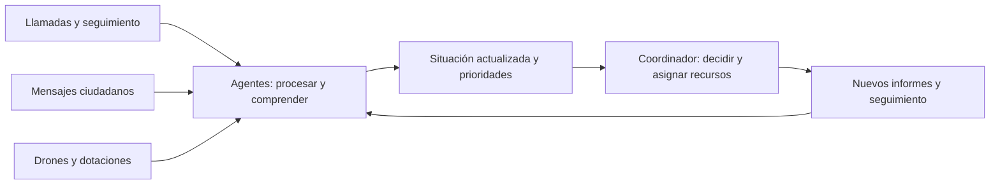

# SUCARA · Comprender más información para decidir mejor

**HackSpain 2026 · Track HappyRobot · DANA de Valencia**

SUCARA es un sistema de agentes de IA que **procesa grandes volúmenes de información en paralelo y con rapidez para tomar mejores decisiones durante una emergencia**. Reúne llamadas, mensajes ciudadanos e informes del terreno, comprende qué está ocurriendo y utiliza esa información para priorizar incidencias y coordinar recursos.

Con HappyRobot, ampliamos la capacidad de recibir avisos y hacer seguimiento de las personas afectadas. Cada actualización ayuda a construir una visión más completa de la situación y a decidir dónde hace más falta actuar. Nuestro objetivo: **reducir el número de fallecidos en una catástrofe**.

## Cuando la información supera la capacidad de atenderla

Durante la DANA de Valencia quedaron **40.000 llamadas sin atender en 48 horas**. Cuando la atención se satura, también se pierde información sobre quién necesita ayuda, dónde está y cómo está evolucionando su situación.


<sub>elDiario.es · Recorte aportado por el equipo.</sub>

En una catástrofe llegan muchos avisos a la vez, por canales distintos y con información incompleta. Atender cada llamada, leer cada mensaje y volver a contactar con cada persona exige tiempo. Mientras tanto, una incidencia leve puede empeorar, una calle puede quedar cortada o un barrio puede perder la comunicación.

**La capacidad de comprender lo que ocurre condiciona la calidad de la respuesta.** Cuanta más información relevante podemos procesar y mantener actualizada, mejor podemos decidir a quién ayudar primero y qué recursos enviar.

## De muchos avisos a una situación comprensible

SUCARA amplía la capacidad de escuchar y observar a través de varias fuentes:

| Fuente | Qué permite conocer |
| --- | --- |
| Llamadas de emergencia | Qué ha ocurrido, dónde se necesita ayuda y en qué estado están las personas afectadas. |
| Llamadas de seguimiento | Si una incidencia pendiente sigue estable o está empeorando. |
| Redes sociales y canales ciudadanos | Avisos dispersos que pueden revelar necesidades todavía desconocidas; esta fuente se explora en el laboratorio de evaluación. |
| Drones e informes de las dotaciones | Qué sucede en zonas sin avisos y qué obstáculos encuentran los equipos sobre el terreno. |

Los agentes convierten esa información en incidencias y prioridades que el coordinador puede utilizar. Relacionar avisos sobre un mismo lugar, interpretar la urgencia de lo que cuentan y reconocer un cambio de situación permite **pasar de datos dispersos a decisiones concretas**.



## HappyRobot: recibir, comprender y seguir en contacto

Con HappyRobot automatizamos un equipo de atención telefónica de emergencias que trabaja en dos frentes:

- **Recepción:** atender avisos, recoger lo ocurrido y convertir cada conversación en información útil para coordinar la respuesta.
- **Seguimiento proactivo:** volver a llamar a personas con incidencias de menor prioridad para comprobar cómo evolucionan y detectar si necesitan ayuda más urgente.

La atención con agentes permite realizar estas tareas en paralelo: mantener el seguimiento de los casos abiertos mientras siguen llegando nuevas emergencias. Así, una llamada inicial se convierte en información que podemos actualizar durante la crisis.

Un **agente de triaje** clasifica las incidencias por prioridad y un **orquestador** coordina la ejecución de los agentes. La información recogida queda disponible para que el coordinador adapte sus decisiones.

## Decidir con una visión más completa

El **agente coordinador** utiliza lo que sabe en cada momento para asignar recursos y ejecutar planes: enviar ambulancias, movilizar bomberos, ordenar rescates o explorar una zona con drones. Decide con información parcial y revisa su respuesta cuando recibe nuevos datos.

Por ejemplo, una llamada de seguimiento puede revelar que una persona que estaba estable ha empeorado. Ese dato cambia la prioridad de la incidencia y permite reconsiderar la asignación de recursos. Un aviso de una dotación sobre una calle inundada puede cambiar cómo llegar hasta ella.

El **Control Center** permite consultar el mapa, las incidencias, las unidades y los hospitales, y recorrer la cronología de avisos y decisiones para entender cómo evoluciona la respuesta.

## Cómo lo evaluamos

Para poner a prueba el sistema construimos un simulador sobre el callejero de Valencia y un **benchmark de escenarios de catástrofe**. Comparamos estrategias y heurísticas con el número de fallecidos como criterio principal. El coordinador solo recibe lo que le comunican sus fuentes; la realidad completa del escenario permite evaluar después sus decisiones.

En nuestras pruebas, añadir muchas reglas no aportaba una mejora clara frente al agente con pocas instrucciones. **Lo que más marcaba la diferencia era disponer de más información para decidir.** Ese resultado orientó el desarrollo hacia ampliar la recepción de avisos, incorporar nuevas fuentes y mantener el contacto con las personas afectadas.

El proyecto es un prototipo de hackathon evaluado en simulación. Las decisiones manuales del operador se registran en la interfaz; su envío al motor está pendiente de integración.

## Cómo levantar el proyecto

### Demo local sin claves de API

Necesitas **Node.js 22.13 o superior y npm**. Desde la raíz del repositorio:

```sh
cd crisis-observatory
npm ci
npm run data:local
npm run dev
```

Abre **[http://localhost:5173](http://localhost:5173)**. Selecciona la ejecución generada y usa los controles de reproducción para recorrerla.

`data:local` genera una simulación de 120 pasos con un coordinador por reglas y la guarda en `gabriel/runs/`. El mapa de Valencia ya está incluido. Para esta demo basta con instalar las dependencias de `crisis-observatory/`; las teselas del mapa se cargan por Internet.

### Ejecutar el coordinador con HappyRobot

Necesitas también **pnpm 10**, una clave de HappyRobot y acceso a los workflows configurados. Mantén el panel abierto y, en otra terminal, parte de la raíz del repositorio:

```sh
cd gabriel
pnpm install --frozen-lockfile
cp .env.example .env
```

Edita `gabriel/.env` y configura `HAPPYROBOT_API_KEY`, `HAPPYROBOT_CLUSTER`, `HAPPYROBOT_WORKFLOW_ID` y `HAPPYROBOT_NODE_ID` con los valores de tu entorno. Los identificadores de ejemplo corresponden a los workflows del hackathon.

Después, desde `gabriel/`:

```sh
pnpm run-sim --coordinator happyrobot --ticks 120 --tick-ms 1000 --no-dream
```

La nueva ejecución aparecerá en el selector del Control Center. `--tick-ms 1000` deja un segundo entre pasos y `--no-dream` omite la consolidación de memoria con otro agente al terminar.

Para ampliar la demo, el runner admite `--desk happyrobot` (generación de llamadas simuladas y triaje), `--master happyrobot` (generación del escenario con un agente) y `--phone` (línea de voz de HappyRobot y seguimiento). Cada integración requiere sus workflows y las variables correspondientes de [`.env.example`](gabriel/.env.example); los detalles están en la [guía del motor](gabriel/README.md).

### Dónde está cada pieza

| Carpeta | Contenido |
| --- | --- |
| [`crisis-observatory/`](crisis-observatory/README.md) | Control Center: frontend React + TypeScript + Vite y API local de lectura de ejecuciones. |
| [`gabriel/`](gabriel/README.md) | Motor de simulación, coordinadores, integración HappyRobot, memoria y laboratorio de evaluación. Escribe las ejecuciones en `gabriel/runs/`. |
| [`backend/`](backend/README.md) | Simulador independiente por CLI. El Control Center utiliza el motor de `gabriel/`. |
| [`deploy/preview/`](deploy/preview/README.md) | Despliegue de la demo en VPS con Docker y Caddy. |

Si el panel está esperando datos, ejecuta `npm run data:local` desde `crisis-observatory/`. Si el puerto 5173 está ocupado, Vite indicará en la terminal la dirección alternativa.
